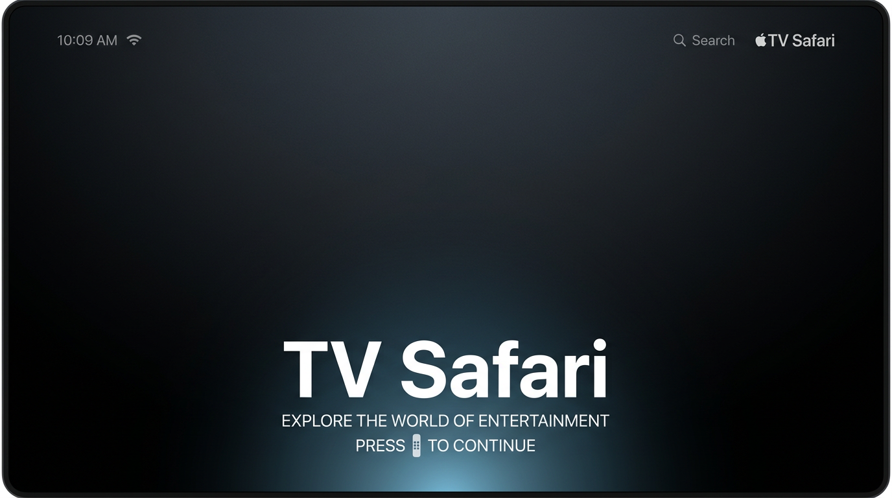
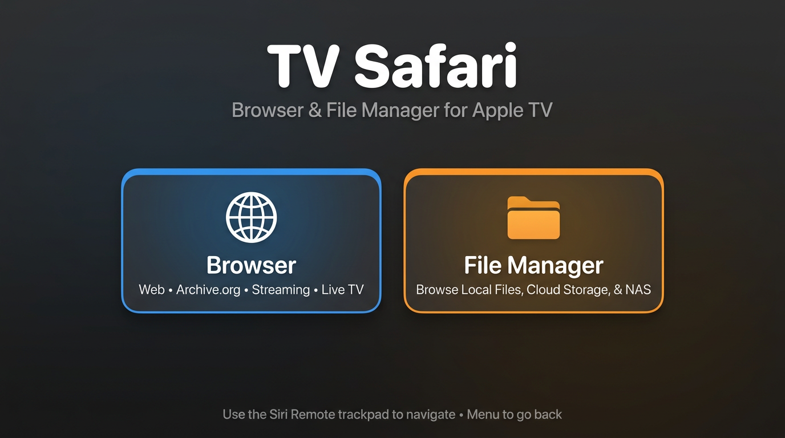
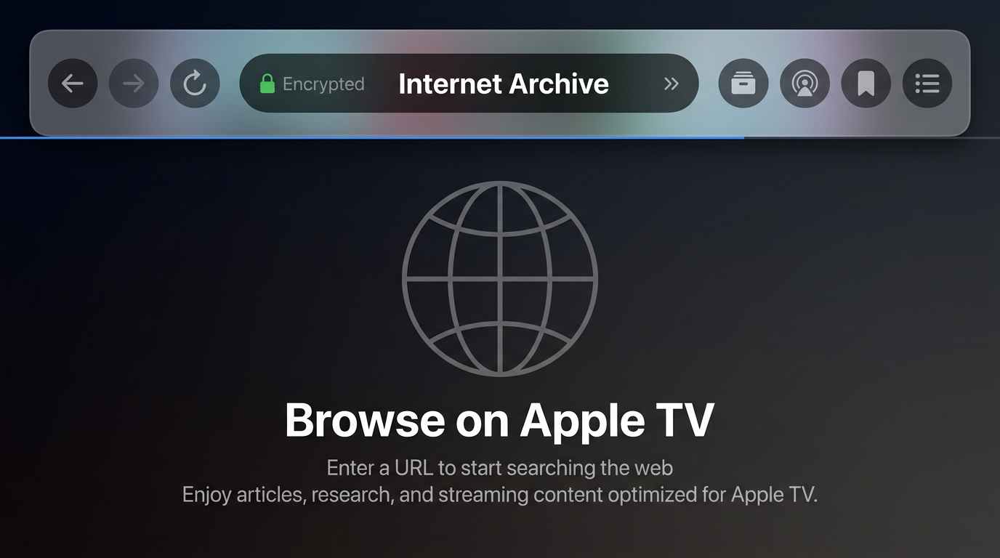

# TV Safari

**TV Safari** is a SwiftUI app for **Apple TV** that combines a **file manager** with a **browser-style shell**: URLs, bookmarks, **Internet Archive**, live-stream pickers, and **HLS (`.m3u8`) playback**. The **TV Safari** target is built for **tvOS 26+** (`TVOS_DEPLOYMENT_TARGET` in **`TV Safari.xcodeproj`**).

Repository: **[github.com/roto31/TV-Safari](https://github.com/roto31/TV-Safari)** — maintained by **[roto31](https://github.com/roto31)**.

---

## Interface overview

Illustrative **mockups** (not screenshots) of the main experiences. See **[docs/visual/TV_Safari_UI_overview.md](docs/visual/TV_Safari_UI_overview.md)** for flow diagrams.

**Cold launch** — `LaunchScreen.storyboard` + `LaunchScreenArt` (brief full-screen still before the main menu).

**Main menu** — choose **Browser** or **File Manager** (`MainMenuView`).

**Browser** — material **top chrome** (navigation, address, actions) and **status canvas** (tvOS has no in-app HTML engine).

---

## Highlights

| Area | What you get |
|------|----------------|
| **Home** | Choose **Browser** or **File Manager** from a focused main menu (`MainMenuView`). A **launch storyboard** (`LaunchScreen.storyboard` + `LaunchScreenArt`) may appear briefly on cold start. |
| **Browser** | **Material** top chrome: grouped back/forward/reload, **address** control (caption + title line), Archive / live streams / bookmark / list; **linear progress** when loading. **tvOS has no in-app HTML engine** — the canvas is a **SwiftUI status screen**; streams open in **`AVPlayer`**. |
| **File manager** | Full filesystem UI in **`ContentView`**: browse, open many types, favorites, search, trash, zip, hex, plist editor, mounts, and more (where the platform allows). |
| **Engineering** | SwiftUI **`@main`** entry (`TVSafariApp`), local packages **`Packages/PrivateKits-tvOS`** and vendored **`Packages/Zip`**, Run Script phases use **`python3`**. Brand assets: **`App Icon & Top Shelf Image`** + Top Shelf wide; design rules in **`.cursor/rules/tvos-safari-design-language.mdc`**. |

---

## Documentation

- **[User guide](docs/TV_SAFARI_USER_GUIDE.md)** — Siri Remote, navigation, behavior, **Mermaid** flow diagrams.  
- **[UI overview (mockups + diagrams)](docs/visual/TV_Safari_UI_overview.md)** — launch, main menu, browser, and navigation flow.  
- **[GitHub Wiki — TV Safari](https://github.com/roto31/TV-Safari/wiki/TV-Safari)** — published mirror; sync via **[docs/wiki/WIKI_SYNC.md](docs/wiki/WIKI_SYNC.md)**.  
- **[Apple HIG — tvOS & watchOS (compiled)](docs/design/Apple_HIG_Design_Rules_watchOS_tvOS.md)** — design principles and platform rules; Cursor rules in **`.cursor/rules/apple-hig-design-governance.mdc`**, **`tvos-design-rules.mdc`**, **`watchos-design-rules.mdc`**.  
- **[LESSONS_LEARNED.md](LESSONS_LEARNED.md)** — build, signing, assets, SwiftPM, Git identity, and documentation sync notes.

---

## Features (file manager)

- Browse directories; path field and refresh  
- View and edit text; hex; plist view/edit  
- Video and audio playback (incl. shared background **`AVPlayer`** + **Play/Pause** shortcut)  
- Images (incl. SVG path), HTML viewing, fonts  
- Create folder / file / symlink; rename; move; copy  
- Trash; delete from trash; favorites  
- Compress / decompress **.zip**  
- Search; mount points; spawn binaries (where allowed)  
- DMG / dpkg-related flows, asset catalog inspection, app icon/name/bundle ID in containers and `/Applications`  
- Multi-select and context actions  
- Localization-ready — **contributions welcome**

---

## Features (browser shell)

- **URL entry** and resolution (https, or **Archive.org** search fallback)  
- **Bookmarks** and visit **history**  
- **Archive.org** sheet; **live stream** catalog sheet  
- **HLS** URLs → full-screen **streaming player**  
- Error banner and loading indicator driven by **`WebViewModel`** (no `WKWebView` on tvOS)

---

## Requirements

- **Xcode** (recent release recommended; project uses **tvOS 26** SDK settings).  
- **Physical Apple TV** for realistic file paths and many features; the **Simulator** is limited (PrivateKits, paths, signing).  
- Many filesystem workflows expect **elevated or modified device access** (e.g. environments that expose **`/private/var/mobile`** and related APIs). Standard retail tvOS sandboxes will not support the full surface area.

---

## Build & run

1. **Clone** this repo.  
2. Open **`TV Safari.xcodeproj`** in Xcode.  
3. **spawn.h** — replace the tvOS SDK **`spawn.h`** inside **`Xcode.app`** with the **`spawn.h`** at the **repository root** when your toolchain requires the project’s POSIX spawn definitions (see **`LESSONS_LEARNED.md`** if you hit related build issues).  
4. **Signing** — in Xcode, enable **Automatically manage signing** and pick your **Team** for **`com.spartanbrowser.tvos`** (the project does not pin a shared `DEVELOPMENT_TEAM` in the repo).  
5. **Build** the **TV Safari** scheme for **Apple TV** and run on device.

SwiftPM dependencies are **local** only (`Packages/Zip`, `Packages/PrivateKits-tvOS`).

---

## Roadmap / TODO

- Narrow legacy **tvOS 13** branches in **`ContentView`** where they still matter.  
- **Asset catalog viewer** improvements.  
- **SFTP** or similar remote file access.  
- Clearer support story on **stock** tvOS where Apple’s policies allow.

---

## License

**[MIT](LICENSE)** — Copyright TV Safari contributors.
