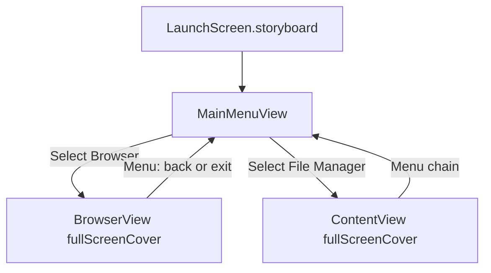
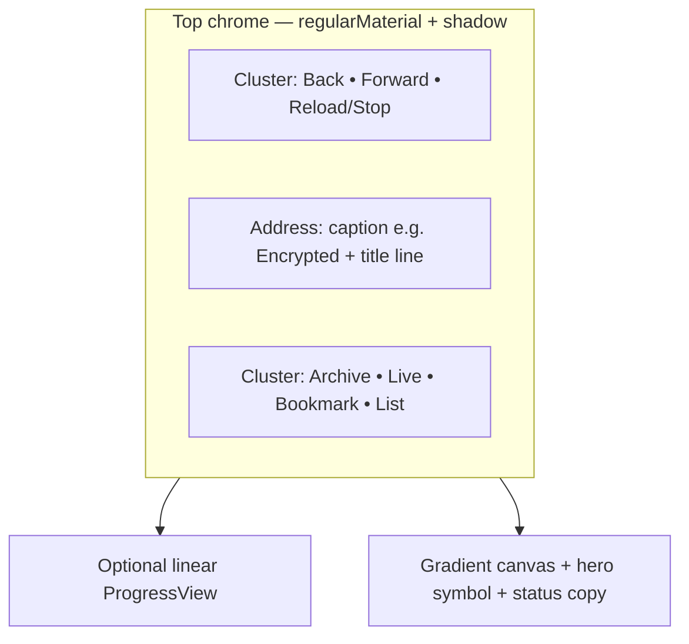
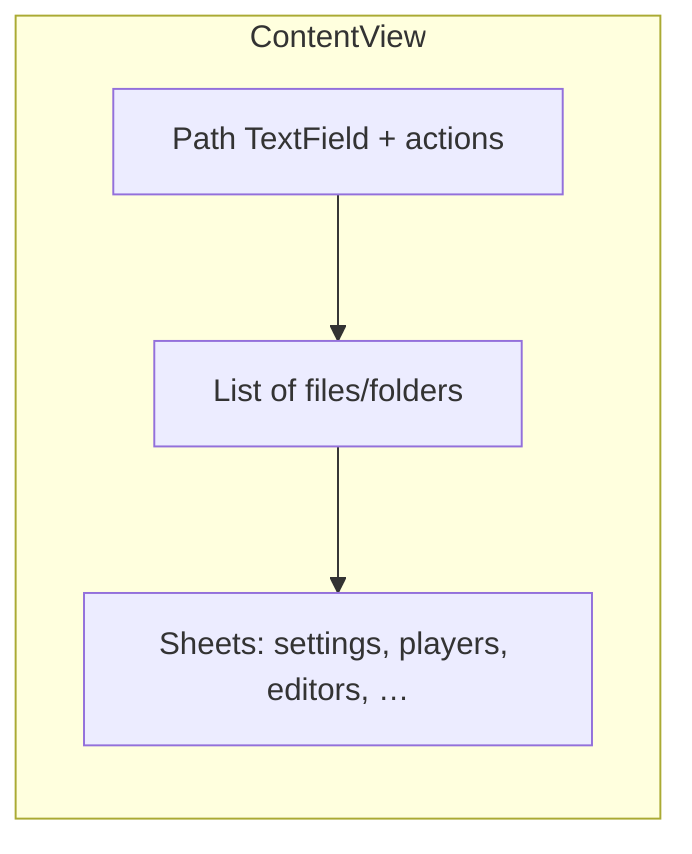

# TV Safari — visual overview

Illustrative **16×9** mockups (not pixel-perfect screenshots) of three primary experiences. For exact behavior and copy, see [`docs/TV_SAFARI_USER_GUIDE.md`](../TV_SAFARI_USER_GUIDE.md).

---

## 1. Cold launch (`LaunchScreen.storyboard`)

Full-screen still shown briefly before `MainMenuView`. Art comes from **`LaunchScreenArt`** in Assets.

---

## 2. Main menu (`MainMenuView`)

Choose **Browser** or **File Manager**; footer explains Siri Remote navigation.

---

## 3. Browser (`BrowserView` + `WebViewRepresentable`)

Frosted **top chrome** (navigation clusters, **address** control, actions). Main area is the **status canvas** (large SF Symbol + typography) — tvOS has no in-app HTML engine.

---

## Flow (Mermaid)

## Browser chrome layout (Mermaid)

## File Manager (conceptual)

---

*Mockup images: `docs/visual/tv-safari-01-launch.png`, `tv-safari-02-main-menu.png`, `tv-safari-03-browser.png`.*
