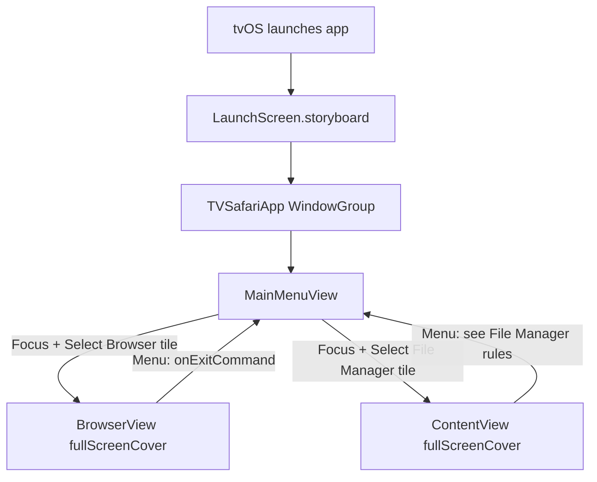
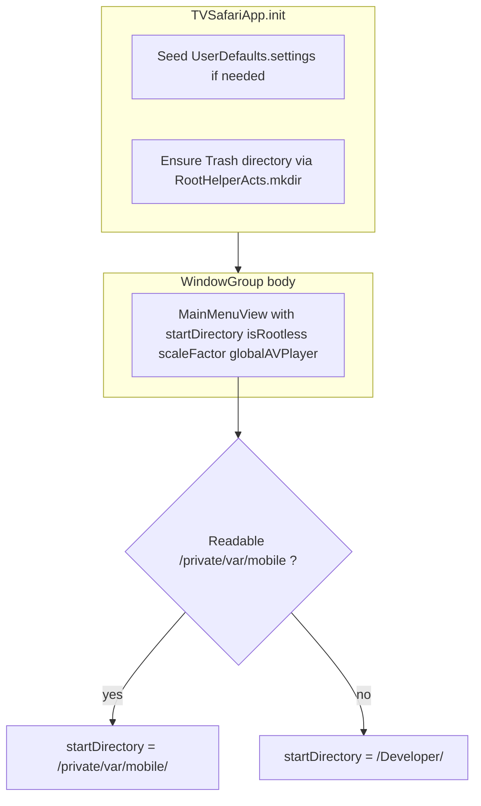
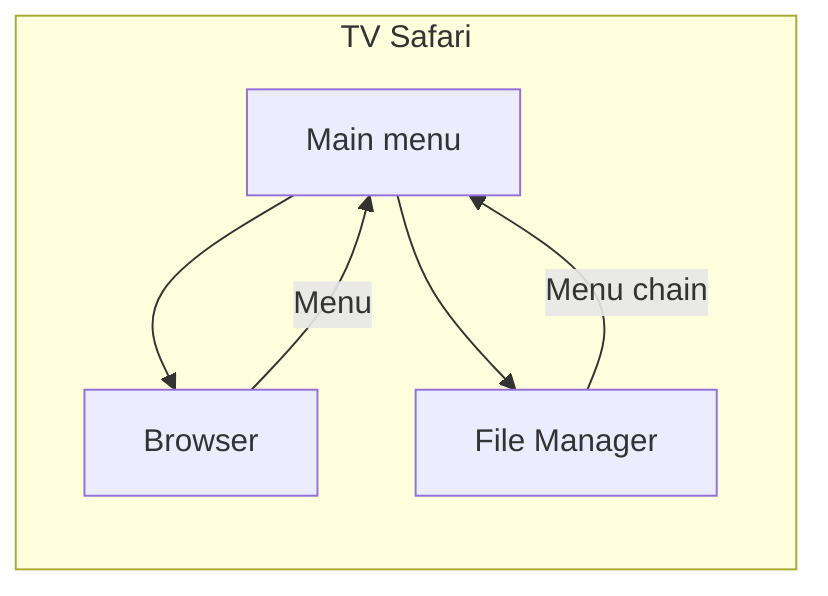
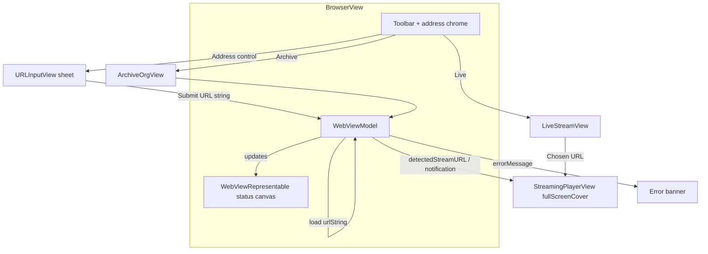
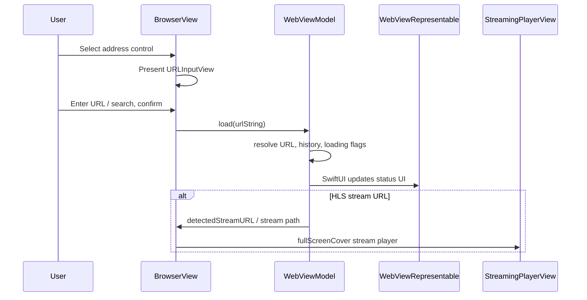
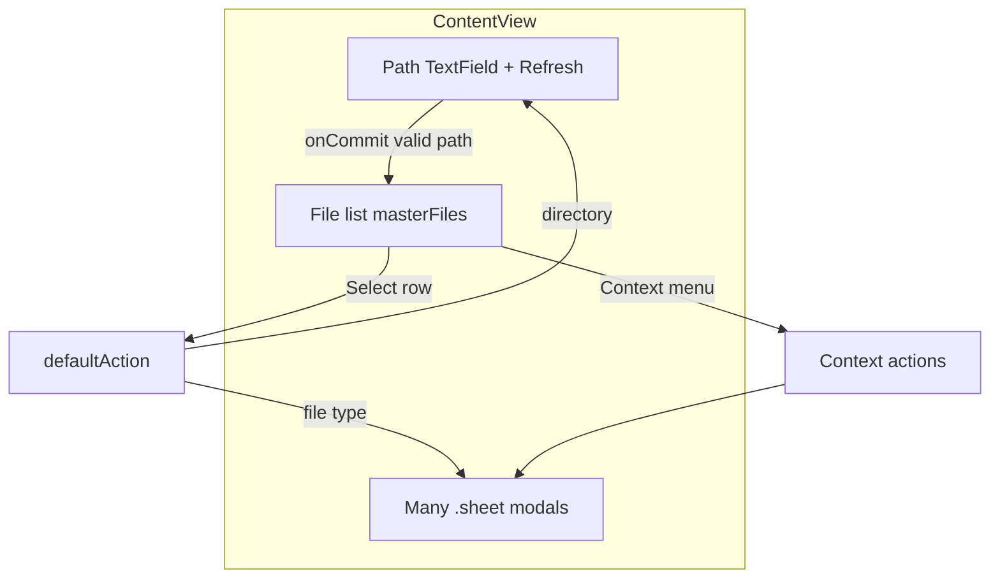
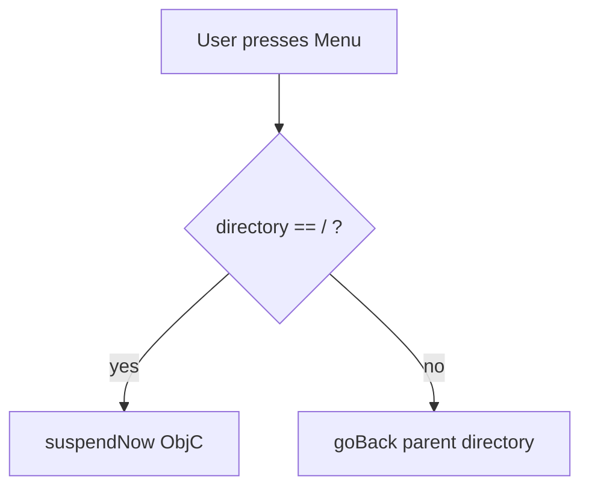
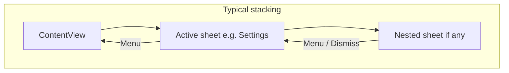

> **Canonical copy in the repository:** [`docs/TV_SAFARI_USER_GUIDE.md`](https://github.com/roto31/TV-Safari/blob/main/docs/TV_SAFARI_USER_GUIDE.md). When application behavior changes, update **both** this wiki page and that file (diagrams and prose together). See project `LESSONS_LEARNED.md` §28 and `.cursor/skills/tv-safari-documentation-sync/SKILL.md`.

# TV Safari — User guide & navigation

This document describes how to use **TV Safari** on Apple TV and how **Siri Remote** (and compatible controllers) map to on-screen actions. Behavior matches the current SwiftUI implementation in this repository.

---

## 1. What TV Safari is

TV Safari combines:

- **Browser** — URL entry, bookmarks, Archive.org shortcuts, live-stream discovery, and **HLS (`.m3u8`) playback** in a full-screen player. **tvOS does not ship an in-app web engine**; the main canvas shows a **SwiftUI status screen** (symbol + typography), not rendered web pages (see [Browser limitations](#5-browser-mode)).
- **File Manager** — Browse the file system, open many file types, favorites, search, trash, compression, and more (requires the environment described in the project README).

---

## 2. Siri Remote — physical controls

Apple TV uses **focus-based** navigation: the **highlighted** control receives **Select** (click).

| Remote action | Typical effect in TV Safari |
|---------------|----------------------------|
| **Touch surface — swipe** | Move **focus** up / down / left / right between buttons, list rows, tiles, and fields. |
| **Touch surface — click** | **Activate** the focused control (same as **Select** on a game controller). |
| **Menu** | **Back**: dismiss sheet, step back in browser history *if enabled*, exit full-screen mode, or **parent directory** in File Manager. At filesystem root `/`, may **suspend** the app (see [File Manager — Menu](#63-menu-back-behavior)). |
| **Play/Pause** | In **File Manager**: opens the **audio player** sheet (shared `AVPlayer` so playback can continue in the background). In some other views (e.g. video/streaming), toggles play/pause where implemented. |
| **TV / Home** (system) | Leaves the app (tvOS system behavior). |

**Tips**

- Move focus slowly on dense screens so the parallax highlight clearly shows which row is active.
- **Text fields** (path bar, URL entry): focus the field, click to edit; use the on-screen keyboard or dictation as supported by tvOS.

---

## 3. First launch — main menu

After the app opens, **MainMenuView** shows two large tiles:

1. **Browser** — Opens the browser full-screen.
2. **File Manager** — Opens **ContentView** starting from `/private/var/mobile/` when that path is readable, otherwise `/Developer/`.

The footer reminds you: *Use the Siri Remote trackpad to navigate • Menu to go back.*

**Cold launch:** tvOS shows **`LaunchScreen.storyboard`** (full-screen art from the **`LaunchScreenArt`** image set in `Assets.xcassets`) until **`MainMenuView`** appears.

**Home Screen & Top Shelf:** The Apple TV **app icon** (Home + App Store layered stacks) and **Top Shelf** images (standard **1920×720** and wide **2320×720**) live in **`App Icon & Top Shelf Image.brandassets`**. `Info.plist` declares **`TVTopShelfPrimaryImage`** and **`TVTopShelfPrimaryImageWide`**.

### 3.1 App entry (startup)

The launch storyboard runs **before** this SwiftUI path; it is not driven by `init`.

---

## 4. High-level application flow

---

## 5. Browser mode

### 5.1 What you see

- **Top chrome** — Frosted **material** bar: **Back**, **Forward**, and **Reload/Stop** grouped on the **left**; **center** **address** control with a **caption** (e.g. Encrypted, Loading, Not encrypted) and a **large primary line** (page title, host, or prompt); **Archive.org**, **Live Streams**, **Bookmark**, and **list** on the **right** (grouped). While loading, a **linear progress** line appears under the chrome.
- **Main area** — **SwiftUI** status canvas (large **SF Symbol** and text), not a web view: tvOS has no `WKWebView`.
- **Error banner** — Appears below the chrome when something fails; you can **dismiss** it; it also **auto-hides** after several seconds.

### 5.2 Remote navigation

- Swipe to move focus across toolbar buttons and the address control.
- **Select** on the address area opens the **Address** sheet (**URLInputView**): large URL field, **Cancel** / **Go**, and quick links on **material** tiles.
- **Select** on Archive / Live / Bookmarks opens the corresponding sheet or flow.
- **Menu** (`onExitCommand`): if `WebViewModel` reports it can go back, **go back**; otherwise **closes** the browser and returns to the main menu. *(Note: back/forward in `WebViewModel` may be no-ops depending on build; if so, **Menu** always exits the browser.)*

### 5.3 Streams

- Loading an **HLS** URL (e.g. ends with `.m3u8`) sets stream detection and can present **StreamingPlayerView** full-screen.
- **Notification** `.webViewStreamDetected` can also trigger the same player when posted with a URL.

---

## 6. File Manager mode (`ContentView`)

### 6.1 Screen layout (conceptual)

- **Top** — Path **TextField** (current directory), **refresh**, and actions that open sheets (new folder, new file, symlink, etc.).
- **Toolbar row** — Multi-select, search, favorites, settings, mount points, and more (labels come from **Localizable.strings**).
- **File list** — One row per file/folder; focus a row and **Select** to open or show the context flow for that item.

### 6.2 Opening files and context actions

- **Select** on a row runs **`defaultAction`** (open folder, or open file by type).
- **Long-press / context** flows (platform-dependent) can show **Open**, **Info**, **Rename**, **Open in…**, **Trash**, etc., implemented as sheets (`showSubView[…]` flags).

### 6.3 Menu (back) behavior

`onExitCommand` on **ContentView**:

- If `directory == "/"` → **`ObjCFunctions.suspendNow()`** (suspends the app — intended for jailbreak / special setups).
- Else → **`goBack()`** to the **parent directory** in the file browser.

So from a **subfolder**, **Menu** moves **up** one level; at **root**, **Menu** triggers suspend (not “exit to tvOS Home” by itself).

### 6.4 Play/Pause in File Manager

`onPlayPauseCommand`:

- Sets audio callback behavior and presents **AudioPlayerView** sheet (`showSubView[10]`), using the shared **`globalAVPlayer`** so music opened elsewhere keeps its position.

---

## 7. Sheets and stacking

Many features are **sheets** (modal layers). **Menu** usually dismisses the topmost sheet or navigates back according to that view’s modifiers (e.g. **SpawnView**, **VideoPlayerView**, **StreamingPlayerView** use `onExitCommand` to close).

---

## 8. Environment & expectations

- **Simulator**: Many File Manager and system paths **do not** match a real Apple TV; the README notes limited simulator support.
- **Device**: Full behavior depends on **readable paths** (e.g. `/private/var/mobile/`), **root helper** where used, and tvOS version.

---

## 9. Related files (for developers)

| Area | Primary Swift sources |
|------|------------------------|
| Entry | `TVSafariApp.swift`, `MainMenuView.swift` |
| Browser | `BrowserView.swift`, `WebViewModel.swift`, `WebViewRepresentable.swift` (shared `BrowserLayout`), `URLInputView.swift`, `BookmarksView.swift`, `ArchiveOrgView.swift`, `LiveStreamView.swift`, `StreamingPlayerView.swift` |
| File Manager | `ContentView.swift` |
| Remote commands | `.onExitCommand`, `.onPlayPauseCommand` on the views above |
| Launch UI | `LaunchScreen.storyboard`, `Assets.xcassets/LaunchScreenArt.imageset`, build setting **`INFOPLIST_KEY_UILaunchStoryboardName`** → `LaunchScreen` |
| Icons & Top Shelf | `Assets.xcassets/App Icon & Top Shelf Image.brandassets/` (layered **App Icon**, **App Icon - App Store**, **Top Shelf Image**, **Top Shelf Image Wide**); `TVSafari/Info.plist` (`CFBundlePrimaryIcon`, `TVTopShelfImage`) |
| Design policy | `.cursor/rules/tvos-safari-design-language.mdc`, `LESSONS_LEARNED.md` §30 |

---

*Last updated to match the in-repo TV Safari target (SwiftUI). If behavior changes in code, update this guide and the diagrams together.*
